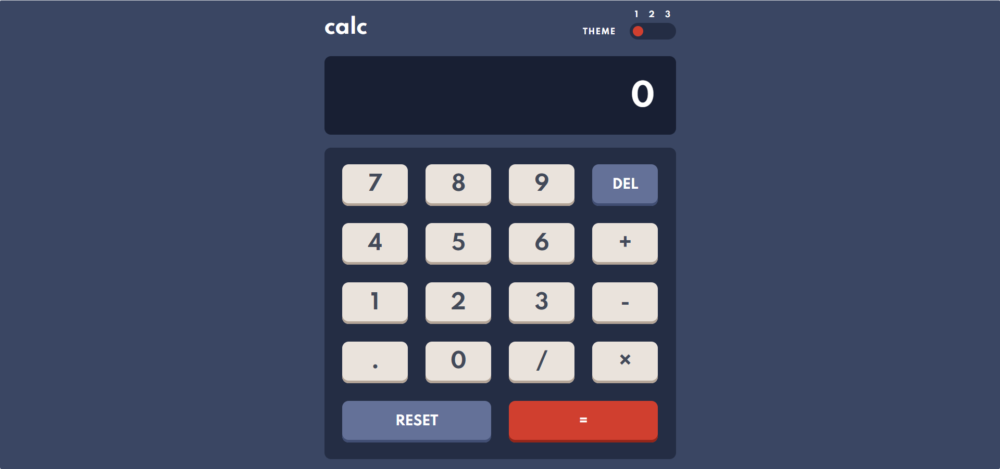

# Frontend Mentor - Calculator app solution

This is a solution to the [Calculator app challenge on Frontend Mentor](https://www.frontendmentor.io/challenges/calculator-app-9lteq5N29). Frontend Mentor challenges help you improve your coding skills by building realistic projects.

## Table of contents

- [Overview](#overview)
  - [The challenge](#the-challenge)
  - [Screenshot](#screenshot)
  - [Links](#links)
- [My process](#my-process)
  - [Built with](#built-with)
  - [Useful resources](#useful-resources)
- [Author](#author)
- [Acknowledgments](#acknowledgments)

## Overview

### The challenge

Users should be able to:

- See the size of the elements adjust based on their device's screen size
- Perform mathmatical operations like addition, subtraction, multiplication, and division
- Adjust the color theme based on their preference
- **Bonus**: Have their initial theme preference checked using `prefers-color-scheme` and have any additional changes saved in the browser

### Screenshot

### Links

- Solution URL: [https://www.frontendmentor.io/solutions/calculator-app-using-scss-and-vanillajs-xAbyyMlas](https://www.frontendmentor.io/solutions/calculator-app-using-scss-and-vanillajs-xAbyyMlas)
- Live Site URL: [https://calculator-app-sooty-ten.vercel.app/](https://calculator-app-sooty-ten.vercel.app/)

## My process

### Built with

- CSS custom properties
- Sass
- Flexbox
- CSS Grid
- Mobile-first workflow
- JavaScript

### Useful resources

- [JavaScript Web Projects: 20 Projects to Build Your Portfolio course](https://www.udemy.com/course/javascript-web-projects-to-build-your-portfolio-resume/) - This course was a great help to me for building the JavaScript logic of a calculator, and also gave me enough knowledge to implement 3 different color themes. I really liked this pattern and will use it going forward.

## Author

- Frontend Mentor - [@hebaghazali0](https://www.frontendmentor.io/profile/hebaghazali)
- LinkedIn - [@hebaghazali](https://www.linkedin.com/in/hebaghazali/)
